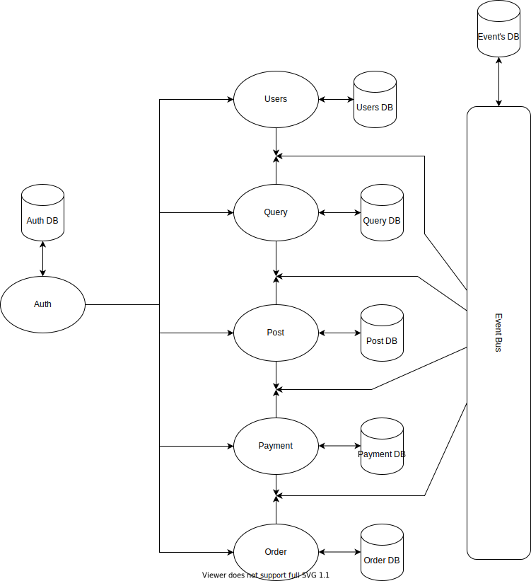

# Resturant-Food-Ordering System 

Users can order and pay for food while sitting in the resturant or diliver to thier location.
Resturant will get thier orders and updates the order status. 

Frontend - React  
Backend - Using Microserices Architecture , Nodejs , Express etc.  
Database - MySql  

## Backend Services 
<strong>user-service :- </strong> Responsible for handling User's Data creatation and updates.  
<strong>post-service :- </strong> Responsible for Posting new items and updation in the items. 
<strong>order-service :- </strong> Responsible for handling orders and thier status. 
<strong>query-service :- </strong> Responsible for giving available items to the users. 
<strong>payment-service :- </strong> Responsible for handling payments for the orders. 
<strong>auth-service :- </strong> Responsible for authentication users and thier persmissons. 

## Services Architecture Design

